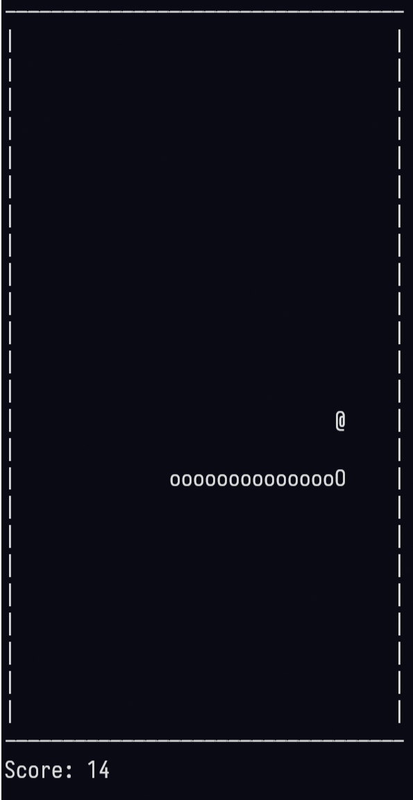

# Yet another Snake game in terminal (except no ncurses)
This implements the classic [snake game](https://en.wikipedia.org/wiki/Snake_(video_game_genre)) as a terminal
game, except this doesnt use the usual [ncurses](https://github.com/mirror/ncurses) interface many terminal implementations
do and instead directly manipulates the [termios](https://www.man7.org/linux/man-pages/man3/termios.3.html) 
interface on *nix systems.


## Building and running
Configure the `config.h` to adjust the game board size and the speed.

To build and run:
```
make
./snake
```
Controls are with arrow keys.


